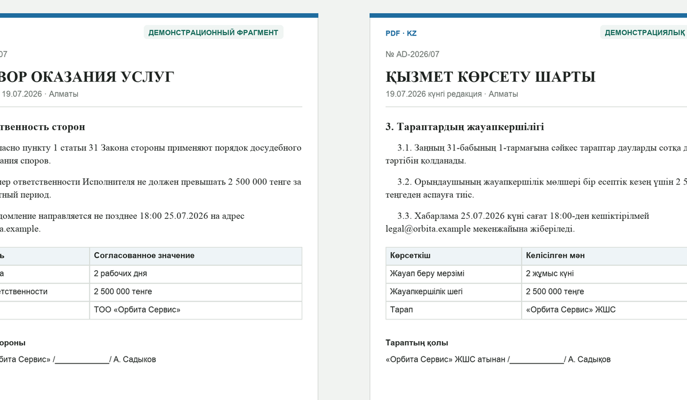
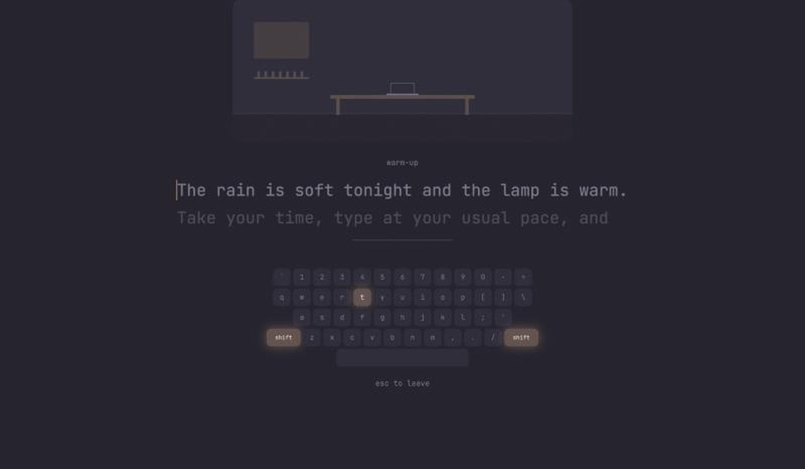
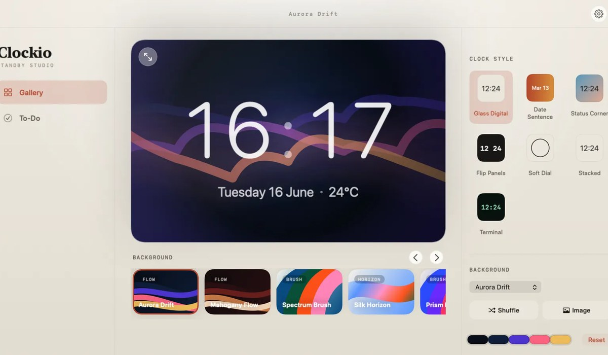
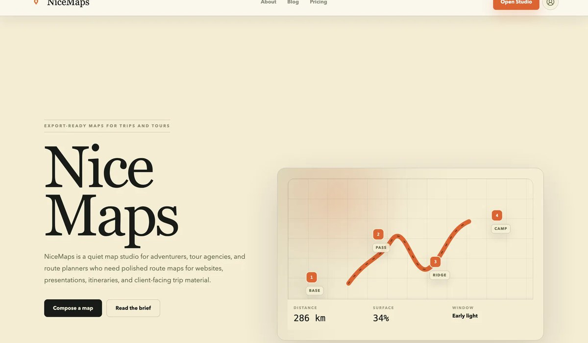

<picture>
  <source media="(prefers-color-scheme: dark)" srcset="assets/banner-dark.svg">
  
</picture>

  
  
  

I study Artificial Intelligence at Johannes Kepler University Linz and build software that people use. My projects start from a real problem, usually one from the tour company I run, and end as something deployed, tested and maintained.

Most of my recent work is around language models in production: retrieval, document pipelines, evaluation, and the checks that stop a fluent answer from being a wrong one.

**Open to working-student and internship roles in AI or software engineering, in Vienna or remote, around 20 hours a week.**

## Selected work

<table>
  <tr>
    <td width="50%" valign="top">
      
      <h3><a href="https://github.com/kritechno/audardoc-showcase">AudarDoc</a></h3>
      
Document translation between Russian and Kazakh that keeps the original layout. A self-repairing LLM pipeline with validators for numbers, dates, negation and terminology, a custom PDF re-layout engine, and an isolated worker for untrusted files. More than 1,000 automated tests. Closed beta.

      
<code>Python</code> <code>FastAPI</code> <code>OpenAI</code> <code>PyMuPDF</code> <code>OCR</code> <code>Docker</code>

    </td>
    <td width="50%" valign="top">
      
      <h3><a href="https://github.com/kritechno/clicko">Clicko</a> · <a href="https://kritechno.github.io/clicko/">play</a></h3>
      
A calm, lofi typing trainer for English and Russian. Ten chapters per language, eight practice modes, weak-key tracking, and a room that fills up as you improve. Runs entirely in the browser with no account and no tracking.

      
<code>React</code> <code>TypeScript</code> <code>Zustand</code> <code>Vite</code> <code>Vitest</code>

    </td>
  </tr>
  <tr>
    <td width="50%" valign="top">
      
      <h3><a href="https://github.com/kritechno/clockio">Clockio</a></h3>
      
A native macOS clock and screensaver. Seven clock styles over animated backgrounds, automatic day and night from local sunrise and sunset, weather, and a built-in to-do list. Rewritten from an Electron prototype into SwiftUI and AppKit.

      
<code>Swift</code> <code>SwiftUI</code> <code>AppKit</code> <code>CoreLocation</code>

    </td>
    <td width="50%" valign="top">
      
      <h3><a href="https://github.com/kritechno/nicemaps">NiceMaps</a></h3>
      
A map studio for composing polished, export-ready route maps for tour agencies and route planners. Build a route, group waypoints by day or region, and export a clean map for slides, print or the web.

      
<code>Next.js</code> <code>React</code> <code>TypeScript</code> <code>Mapbox GL</code> <code>Tailwind</code>

    </td>
  </tr>
</table>

## Built for a real business

I run [SilkOffRoad Tours](https://silkoffroadtours.com), a motorcycle tour company in Central Asia, and I build its internal tools. The code is private because it holds customer data, and I am happy to walk through it in an interview.

- **SilkOffRoad AI Agent.** A local-first desktop assistant that drafts grounded, cited replies to client inquiries from the tour dataset. Two models split triage and drafting, two independent guardrail layers block any price or term that is not in the source, and a human approves every reply. In production. `Electron` `React` `SQLite` `OpenAI` `Gemini` `Ollama`
- **SilkCRM.** The CRM that runs daily operations: passport scans to structured client records through OCR, agreements generated from templates, rooming lists, expense imports with per-tour margins, and an audit trail. `Python` `FastAPI` `PostgreSQL` `Docker`

## Toolbox

**AI and ML** · LLM agents and pipelines, RAG, guardrails and evaluation, NLP and machine translation, OCR, PyTorch

**Backend** · Python, FastAPI, Node.js, PostgreSQL, SQLite, REST APIs, document processing

**Frontend and apps** · TypeScript, React, Next.js, Electron, React Native, Swift and SwiftUI

**Shipping** · Docker, GitHub Actions, pytest, Vitest, Railway, Cloudflare

## Get in touch

The fastest way to reach me is [LinkedIn](https://www.linkedin.com/in/amir-buzubayev). More projects and case studies are at [amirbuzubayev.com](https://amirbuzubayev.com).
